# Research-PDFGPT
Transforms user data and HTML templates into clean, ready-to-download PDFs.

A specialized GPT architecture designed to transform conversational research into publication-ready PDF reports. This project bridges the gap between AI-driven knowledge synthesis and professional document formatting using OpenAI Actions and APITemplate.io.

🚀 The Problem
Standard LLM outputs are often unstructured and difficult to format for professional use. When converting chat logs to PDF, common issues include:

Orphaned Headers: Headings appearing at the bottom of a page without content.

Inconsistent Styling: Loss of hierarchical structure (H1, H2, H3).

Manual Effort: The need to copy-paste data into external editors.

🛠 The Solution
This GPT uses a logic-driven system prompt and CSS-aware HTML mapping to ensure every generated PDF follows professional layout standards.

Key Features
Contextual Synthesis: Analyzes chat history to generate relevant report content automatically.

Intelligent Layout Logic: Uses a custom keep-together wrapper system to prevent awkward page breaks.

API Orchestration: Real-time integration with APITemplate.io for instant PDF generation.

Structured Data Mapping: Converts natural language into a strictly validated JSON payload.

📂Repository Structure

```mermaid
    graph TD
    %% Root Node
    Root[research-gpt-api/]
    
    %% Main Folders
    Sub1[.github/]
    Sub2[assets/]
    Sub3[gpt-configuration/]
    Sub4[web-assets/]
    Sub5[examples/]
    Sub6[README.md]

    %% Connections to Folders
    Root --> Sub1
    Root --> Sub2
    Root --> Sub3
    Root --> Sub4
    Root --> Sub5
    Root --> Sub6

    %% Assets Folder Files
    Sub2 --> A1[ResearchGPT_Workflow-.png]
    Sub2 --> A2[Sample-output.png]
    Sub2 --> A3[Final Output.pdf]
    Sub2 --> A4[Sample Conversation Output.png]

    %% GPT Configuration Folder Files
    Sub3 --> G1[instructions.md]
    Sub3 --> G2[openapi-schema.yaml]
    Sub3 --> G3[Conversation-starters.md]
    Sub3 --> G4[Gpt_actions.md]

    %% Web Assets Folder Files
    Sub4 --> W1[base-styles.css]
    Sub4 --> W2[template-structure.html]

    %% Examples Folder Files
    Sub5 --> E1[raw-chat-context.png]
    Sub5 --> E2[api-payload-sample.json]

    %% Styling
    style Root fill:#f9f,stroke:#333,stroke-width:2px
    style Sub6 fill:#bbf,stroke:#333,stroke-width:1px
    style Sub2 fill:#dfd,stroke:#333
    style Sub3 fill:#dfd,stroke:#333
    style Sub4 fill:#dfd,stroke:#333
    style Sub5 fill:#dfd,stroke:#333
```
    

    
⚙️ Technical Workflow
The system operates through a three-tier transformation process:

Logic Tier (GPT): The GPT acts as an expert assistant, synthesizing user queries.

Transformation Tier (HTML/JSON): The GPT maps the content into a specific JSON structure, wrapping sections in 
 based on predefined heuristic rules.

Delivery Tier (API): The GPT triggers a POST request to the APITemplate.io endpoint, passing the structured HTML to a pre-configured template (ID: 0c677b235eb23128).

The "Keep-Together" Logic
To ensure professional quality, the GPT is programmed to follow specific HTML patterns:

    <h2>Section Title</h2>
    <ul>
        <li>Key data point 1</li>
        <li>Key data point 2</li>
    </ul>

This ensures that the header and the list are never separated by a page break.

🔗 Setup & Integration
1. GPT Instructions
Copy the content of gpt-configuration/instructions.md into the "Instructions" section of your Custom GPT.

2. API Configuration
1.Import gpt-configuration/openapi-schema.yaml into the "Actions" section.

2.Set Authentication to API Key (Header: X-API-KEY).

3.Ensure your APITemplate.io account has a template matching the provided ID.

📄 Sample Output
Raw Chat: View Sample Conversation

Generated PDF: Download Sample Report
